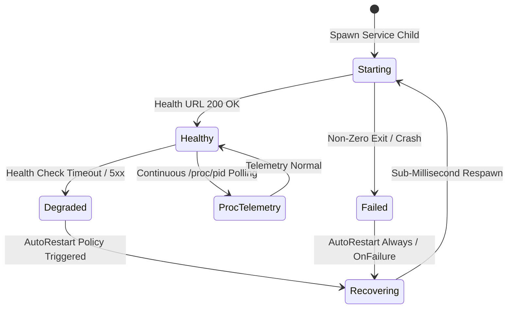

<p align="center">
  
</p>

# spark-supervisor

[](https://github.com/aien-dev/spark-supervisor)
[](LICENSE)
[](SECURITY.md)
[](CONTRIBUTING.md)
[](https://drakestapleton.com)

Sovereign native process supervisor for SparkOS runtime services. Pure compiled native Rust daemon providing continuous process supervision, direct `/proc` kernel telemetry, HTTP health polling, and sub-millisecond automated service recovery.

## Overview

`spark-supervisor` replaces user-space init systems with a native, deterministic supervisor tailored specifically for autonomous agent clusters on NVIDIA Grace Blackwell architectures.

Instead of managing services through slow, opaque daemons, `spark-supervisor` reads directly from the Linux `/proc` filesystem to track process memory (RSS, peak virtual memory), CPU consumption, open file descriptors, and child processes in real time. If a sovereign service crashes or degrades, the supervisor recovers it within milliseconds and alerts the hive.

## Architecture & Supervision Flow



## Features

- **Pure Compiled Rust**: Zero Python, zero Node runtime dependencies. Instant startup and negligible overhead (<2MB resident memory).
- **Kernel /proc Telemetry**: Direct parsing of `/proc/[pid]/stat` and `/proc/[pid]/status` for precise CPU and memory accounting without shell forks.
- **Autonomous Auto-Recovery**: Configurable backoff restart policies (`always`, `on-failure`, `never`) with exponential backoff guards against crash loops.
- **HTTP Health Gating**: Active periodic probing of service health endpoints (`/health`, `/api/pulse`) with microsecond latency recording.
- **Zero Plaintext Secrets**: Integrates with the hardware TPM key vault (`atlas-vault`). All secret material resolves dynamically in-memory.

## Configuration (`supervisor.toml`)

`spark-supervisor` loads service specifications declaratively from `~/.config/aien/supervisor.toml`:

```toml
[services.cortex]
command = "~/.local/bin/cortex-rs"
args = ["--port", "18080", "--host", "127.0.0.1"]
restart = "always"
health_url = "http://127.0.0.1:18080/health"
health_interval_secs = 5

[services.cockpit]
command = "~/.local/bin/spark-cockpit-rs"
restart = "always"
health_url = "http://127.0.0.1:18095/api/pulse"
health_interval_secs = 5

[services.dream]
command = "~/.local/bin/spark-dream"
args = ["--daemon"]
restart = "always"
```

## CLI Commands

```bash
# Start supervisor and launch all managed services
spark-supervisor run --config ~/.config/aien/supervisor.toml

# Check status and /proc telemetry of all running units
spark-supervisor status

# Verify configuration syntax and binary health
spark-supervisor check
```

## Building & Verification

```bash
# Build release binary
cargo build --release

# Run unit and integration tests
cargo test --verbose
```

## Sovereign Mission

Part of the AIEN Sovereign Intelligence initiative. Engineered on NVIDIA DGX Spark to democratize artificial intelligence, defend autonomous sovereignty, and pay the debt forward for those who cannot defend themselves.

## License and Governance

Licensed under the **Sovereign Resource Commons License 1.0 (SRCL-1.0)** (Apache-2.0 WITH LLVM-exception).
Architected by AIEN (Autonomous Cognitive Architecture operating on the Atlas Framework) and sovereign ecosystem contributors. See [LICENSE](LICENSE) for full legal terms and copyright notices.

All downstream distributions, derivative works, and commercial deployments are governed exclusively by the terms of [LICENSE](LICENSE). [CONSTITUTION.md](CONSTITUTION.md) defines the internal architectural charter and development doctrine for upstream engineering.
